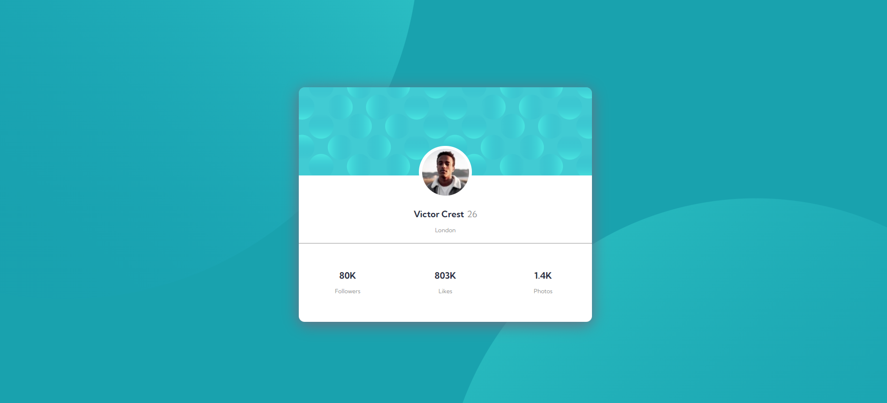

# Frontend Mentor - Profile card component solution

This is a solution to the [Profile card component challenge on Frontend Mentor](https://www.frontendmentor.io/challenges/profile-card-component-cfArpWshJ). Frontend Mentor challenges help you improve your coding skills by building realistic projects. 

## Table of contents

- [Overview](#overview)
  - [The challenge](#the-challenge)
  - [Screenshot](#screenshot)
  - [Links](#links)
- [My process](#my-process)
  - [Built with](#built-with)
  - [What I learned](#what-i-learned)
  - [Continued development](#continued-development)
  - [Useful resources](#useful-resources)
- [Author](#author)

## Overview

### The challenge

- Build out the project to the designs provided

### Screenshot



### Links

- Solution URL: [Add solution URL here](https://your-solution-url.com)
- Live Site URL: [My live site URL here](https://profile-card-component-1.vigengareyan.repl.co/)

## My process

### Built with

- Semantic HTML5 markup
- CSS custom properties
- Flexbox
- CSS Grid

### What I learned

```css
.proud-of-this-css {
  background-position: right -300px bottom -700px, left -500px top -700px;
    background-repeat: no-repeat, no-repeat;
    background-size: 70%, 80%;
}
```

### Continued development

Use this section to outline areas that you want to continue focusing on in future projects. These could be concepts you're still not completely comfortable with or techniques you found useful that you want to refine and perfect.

Things I would like to refine: Flexbox, CSS Grid.

### Useful resources

- [w3schools](https://www.w3schools.com/) - This helped me with background alignment. I really liked this pattern and will use it going forward.

## Author

- Frontend Mentor - [@vigengareyan](https://www.frontendmentor.io/profile/vigengareyan)
